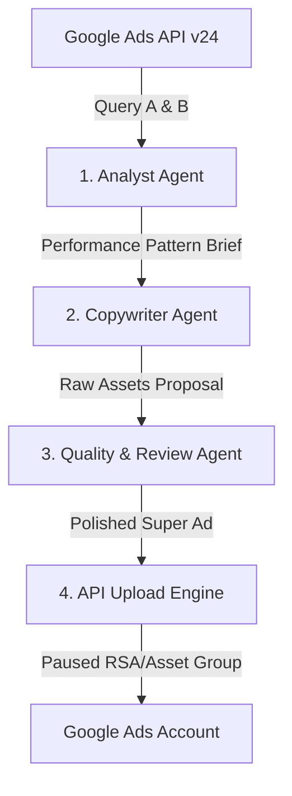

# conversion-retention-pipeline: Google Ads Conversion Retention & Recombination CLI (v2.0)

`conversion-retention-pipeline` is a premium, data-driven AI agent CLI tool designed to find the **Sweet Spot** in conversion retention. By querying active Responsive Search Ads (RSAs) and Performance Max (PMax) campaign text assets, it calculates performance-weighted scoring, extracts high-converting language patterns, and recombines the best elements to compile and upload the absolute "SUPER ADS" back to Google Ads.

All model executions run using the **Antigravity Agent Bridge** or Gemini API key, ensuring native integration with modern LLM capabilities.

---

## 1. AI Agent Pipeline Architecture

Conversion Retention 2.0 employs an automated, multi-stage orchestration pipeline of **5 specialized persistent AI agents**:



### The 5 Persistent Agents:
*   **`rsa_analyst` (RSA Conversion Retention Analyst)**: Extracts proven language patterns from historical RSA performance data, maps weights, and compiles the structured `RSA Performance Pattern Brief`.
*   **`rsa_copywriter` (RSA Creative Copywriter)**: Takes the brief as binding input and generates 15 high-converting headlines and 4 descriptions using a distinct copywriting framework (PAS, Benefit-First, Social Proof, or Rational Utility).
*   **`rsa_review` (RSA Quality & Compliance Reviewer)**: Polishes the copy for compliance, removing trailing periods, exclamation marks, and prohibited pushy copy.
*   **`pmax_analyst` (PMax Conversion Retention Analyst)**: Conducts advanced weighted pattern analysis across complex Performance Max asset groups, creating the `PMax Performance Pattern Brief`.
*   **`pmax_copywriter` (PMax Creative Copywriter)**: Composes 15 headlines, 4 long headlines, and 4 descriptions matching PMax requirements.

---

## 2. Advanced Mathematical Scoring & Weighting

Instead of subjective evaluation, the pipeline performs concrete mathematical scoring based on historical conversion values:

### A. The Performance Factor
For each active Ad Group (Search) or Asset Group (PMax):
1.  The system calculates the **median conversions** of all enabled groups in the account over the last 90 days.
2.  An **Ad/Asset Group Faktor** is calculated:
    $$\text{Group Factor} = \frac{\text{Conversions of this Group}}{\text{Median Conversions in Account}}$$

### B. Conversion Threshold
To filter out noise and prioritize statistically significant signals:
*   **Minimum Threshold**: A group must have **$\geq 5$ conversions** in the 90-day period. If it has less, the assets of that group are ignored.

### C. Asset Weighting
The base weight of each asset is determined by Google's relative `performance_label`:
*   **BEST**: Base Weight $3\times$
*   **GOOD**: Base Weight $2\times$
*   **LOW**: Base Weight $0\times$ (Placed on the Negative List)
*   **LEARNING/PENDING**: Ignorieren

$$\text{Final Asset Weight} = \text{Base Weight} \times \text{Group Factor}$$

### D. Campaign Similarity Weighting (PMax Only)
For Performance Max, similarity multipliers are applied to assets to prioritize local campaign relevance:
*   Assets belonging to the **Target Campaign**: Multiplier $4\times$
*   Assets sharing the same **Final URL Domain**: Multiplier $2\times$
*   Account-wide assets: Multiplier $1\times$

---

## 3. Data Pull & Direct API Mutate Uploads

### Google Ads Queries (API Version v24)
The tool queries two specific endpoints to pull all necessary data:
*   **Query A (Asset Performance)**: Fetches text assets, field types, and performance labels for active RSAs and PMax groups.
*   **Query B (Group Level Metrics)**: Fetches impressions, clicks, conversions, conversion values, and cost micros over the `LAST_90_DAYS` to determine group factor values.

### Automated Mutate Upload (Step 4)
When a workflow runs, the CLI automates the upload to Google Ads:
1.  **Text Assets Mutate**: Uploads the 15 headlines and descriptions in a single mutate request, returning their resource names.
2.  **Ad Creation Mutate**: Creates a new Responsive Search Ad or PMax Asset Group (linking text and cloned marketing images) as **`PAUSED`**, letting you review the compiled "SUPER AD" before activation.

---

## 4. Chatting Directly with AI Agents

You can start an interactive, multi-turn chat session with any of the persistent agents. This is useful for manual brainstorming, auditing strategy rules, or copywriting.

Start a chat session:
```bash
node bin/index.js chat
```
Or target a specific agent:
```bash
node bin/index.js chat rsa_analyst
```
The session maintains context and conversation history. Type `exit` to quit.

---

## 5. Command Reference

*   **Interactive Terminal Dashboard**:
    ```bash
    node bin/index.js
    ```
*   **Run Optimization Workflow**:
    ```bash
    node bin/index.js run-workflow
    ```
    *Add `--sandbox` to simulate the workflow using realistic campaign mock data.*
*   **List Stored AI Agents**:
    ```bash
    node bin/index.js agent list
    ```
*   **Verify Setup & Storage**:
    ```bash
    node bin/index.js verify
    ```

---

*Created via Google Antigravity CLI | 100% Secure & Compliant API Integrations*
