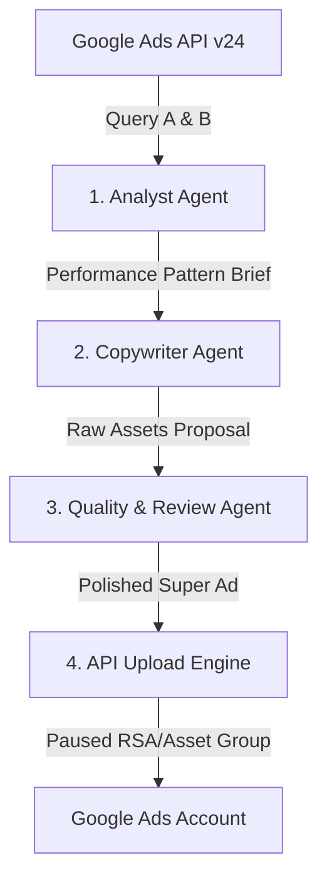
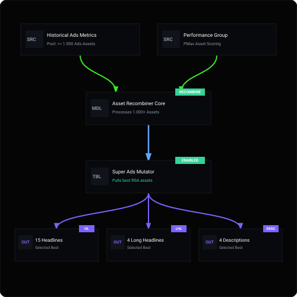

# conversion-retention-pipeline: Google Ads Conversion Retention & Recombination CLI (v2.0)

`conversion-retention-pipeline` is a premium, data-driven AI agent CLI tool designed to find the **Sweet Spot** in conversion retention. By querying active Responsive Search Ads (RSAs) and Performance Max (PMax) campaign text assets, it calculates performance-weighted scoring, extracts high-converting language patterns, and recombines the best elements to compile and upload the absolute "SUPER ADS" back to Google Ads.

All model executions run using the **Antigravity Agent Bridge** or Gemini API key, ensuring native integration with modern LLM capabilities.

> [!IMPORTANT]
> **Prerequisite for AI Processing:**
> Please start Google Antigravity beforehand using the command **`agy`** in your console!
> Interactive chat sessions, asset generation workflows, and AI processing run exclusively **INSIDE the Antigravity CLI**. In a standard terminal shell outside Antigravity, no AI processing takes place, and static execution outputs are intercepted with a guidance notice.

---

## 1. AI Agent Pipeline Architecture

Conversion Retention 2.0 employs an automated, multi-stage orchestration pipeline of **5 specialized persistent AI agents**:


```mermaid
graph TD
    API[Google Ads API v24] -->|Query A & B| Agent1[1. Analyst Agent]
    Agent1 -->|Performance Pattern Brief| Agent2[2. Copywriter Agent]
    Agent2 -->|Raw Assets Proposal| Agent3[3. Quality & Review Agent]
    Agent3 -->|Polished Super Ad| Agent4[4. API Upload Engine]
    Agent4 -->|Paused RSA/Asset Group| GoogleAds[Google Ads Account]
```

### System Architecture Circuit

<p align="center">
  
</p>

> *(Interactive standalone circuit widget available at [`docs/system-circuit.html`](docs/system-circuit.html))*

### The 5 Persistent Agents:
*   **`rsa_analyst` (RSA Conversion Retention Analyst)**: Extracts proven language patterns from historical RSA performance data, maps weights, and compiles the structured `RSA Performance Pattern Brief`.
*   **`rsa_copywriter` (RSA Creative Copywriter)**: Takes the brief as binding input and generates 15 high-converting headlines and 4 descriptions using a distinct copywriting framework (PAS, Benefit-First, Social Proof, or Rational Utility).
*   **`rsa_review` (RSA Quality & Compliance Reviewer)**: Polishes the copy for compliance, removing trailing periods, exclamation marks, and prohibited pushy copy.
*   **`pmax_analyst` (PMax Conversion Retention Analyst)**: Conducts advanced weighted pattern analysis across complex Performance Max asset groups, creating the `PMax Performance Pattern Brief`.
*   **`pmax_copywriter` (PMax Creative Copywriter)**: Composes 15 headlines, 4 long headlines, and 4 descriptions matching PMax requirements.

---

## 2. Advanced Mathematical Scoring & Weighting

Instead of subjective evaluation, the pipeline performs concrete mathematical scoring based on historical conversion values:

### A. The Performance Factor
For each active Ad Group (Search) or Asset Group (PMax):
1.  The system calculates the **median conversions** of all enabled groups in the account over the last 90 days.
2.  An **Ad/Asset Group Faktor** is calculated:
    $$\text{Group Factor} = \frac{\text{Conversions of this Group}}{\text{Median Conversions in Account}}$$

### B. Conversion Threshold
To filter out noise and prioritize statistically significant signals:
*   **Minimum Threshold**: A group must have **$\geq 5$ conversions** in the 90-day period. If it has less, the assets of that group are ignored.

### C. Asset Weighting
The base weight of each asset is determined by Google's relative `performance_label`:
*   **BEST**: Base Weight $3\times$
*   **GOOD**: Base Weight $2\times$
*   **LOW**: Base Weight $0\times$ (Placed on the Negative List)
*   **LEARNING/PENDING**: Ignorieren

$$\text{Final Asset Weight} = \text{Base Weight} \times \text{Group Factor}$$

### D. Campaign Similarity Weighting (PMax Only)
For Performance Max, similarity multipliers are applied to assets to prioritize local campaign relevance:
*   Assets belonging to the **Target Campaign**: Multiplier $4\times$
*   Assets sharing the same **Final URL Domain**: Multiplier $2\times$
*   Account-wide assets: Multiplier $1\times$

---

## 3. Data Pull & Direct API Mutate Uploads

### Google Ads Queries (API Version v24)
The tool queries two specific endpoints to pull all necessary data:
*   **Query A (Asset Performance)**: Fetches text assets, field types, and performance labels for active RSAs and PMax groups.
*   **Query B (Group Level Metrics)**: Fetches impressions, clicks, conversions, conversion values, and cost micros over the `LAST_90_DAYS` to determine group factor values.

### Automated Mutate Upload (Step 4)
When a workflow runs, the CLI automates the upload to Google Ads:
1.  **Text Assets Mutate**: Uploads the 15 headlines and descriptions in a single mutate request, returning their resource names.
2.  **Ad Creation Mutate**: Creates a new Responsive Search Ad or PMax Asset Group (linking text and cloned marketing images) as **`PAUSED`**, letting you review the compiled "SUPER AD" before activation.

---

## 4. Chatting Directly with AI Agents

You can start an interactive, multi-turn chat session with any of the persistent agents. This is useful for manual brainstorming, auditing strategy rules, or copywriting.

Start a chat session:
```bash
node bin/index.js chat
```
Or target a specific agent:
```bash
node bin/index.js chat rsa_analyst
```
The session maintains context and conversation history. Type `exit` to quit.

---

## 5. CLI & Agent Command Reference

Die Bedienung erfolgt interaktiv über das Terminal Dashboard oder direkt per Kommandozeilenbefehl innerhalb der Google Antigravity CLI (`agy`):

| Befehl | Beschreibung |
| :--- | :--- |
| `node bin/index.js` / `dashboard` | Startet das interaktive Terminal-Dashboard mit Statusübersicht, Agent-Status und Menüführung. |
| `node bin/index.js run-workflow` | Führt die vollständige 4-stufige Conversion Retention Pipeline aus: Datenabfrage (API v24), Sweet-Spot-Scoring, Recombination durch KI-Agenten und Erstellung der SUPER AD Mutates. Mit `--sandbox` wird die Analyse mit realistischen Mock-Daten simuliert. |
| `node bin/index.js chat` | Startet eine interaktive Multi-Turn-Chat-Session. Wird kein Name übergeben, öffnet sich ein Auswahlmenü. Unterstützt: `rsa_analyst`, `rsa_copywriter`, `rsa_review`, `pmax_analyst`, `pmax_copywriter`. |
| `node bin/index.js agent list` | Listet alle registrierten AI Agents mit Rolle, Modell und Kurzbeschreibung auf. |
| `node bin/index.js agent view <name>` | Zeigt das detaillierte Profil, die internen Richtlinien und den System-Prompt des angegebenen Agenten an. |
| `node bin/index.js setup` | Interaktiver Einrichtungsassistent für die Google Ads API v24 (Customer ID, OAuth Client ID/Secret, Developer Token, lokaler OAuth-Callback-Server auf Port 8085). |

### Verfügbare KI-Agenten & Aufgaben

*   **`rsa_analyst`**: Analysiert Responsive Search Ads Performance-Labels (`BEST`, `GOOD`, `LOW`) und berechnet Gruppen-Gewichtungen.
*   **`rsa_copywriter`**: Generiert datenbasierte Recombinations-Headlines (max. 30 Zeichen) und Descriptions (max. 90 Zeichen) basierend auf Gewinner-Assets.
*   **`rsa_review`**: Validiert Zeichenbegrenzungen, Google Ads Richtlinien und verhindert Asset-Kannibalisierung.
*   **`pmax_analyst`**: Bewertet Performance Max Asset Groups und aggregiert Asset-Performance auf Domain- und Kampagnenebene.
*   **`pmax_copywriter`**: Erstellt kampagnenübergreifend optimierte Text-Assets für PMax Asset Groups.

---

## 6. Make.com AI Agents Integration (Blueprints)

Zusätzlich zur CLI-Ausführung stehen im Unterordner [`make-blueprints/`](make-blueprints/) zwei fertige Szenarien-Vorlagen zur Verfügung, mit denen du die Conversion Retention komplett über **Make.com mit Gemini AI Agents** bedienen kannst:

*   **`AIP SWA Conversion Retention RSA.blueprint.json`**: Automatisierte Conversion Retention für Responsive Search Ads (RSAs).
*   **`AIP SWA - Conversion Retention Agent PMax Asset Groups.blueprint.json`**: Automatisierte Conversion Retention für Performance Max (PMax) Asset Groups.

Eine detaillierte Schritt-für-Schritt-Anleitung zum Import und zur Konfiguration findest du im [Make Blueprints Guide](make-blueprints/README.md).

---

*Created via Google Antigravity CLI | 100% Secure & Compliant API Integrations*

